# Project Valentine

`Login name: woobaby, home directory: /home/woobaby. The home directory contains these sub-directories: code, tests, personal, misc. Unless otherwise specified, you are running commands from the home directory.`

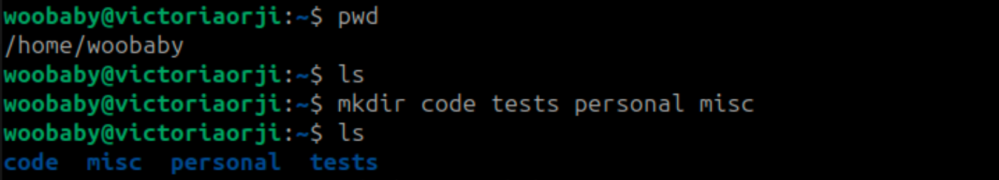

1. `Change directory to the tests directory using absolute pathname`

2. `Change to the tests directory using relative pathname`

3. `Use echo command to create a file named fileA with text content 'Hello A' in the misc directory`

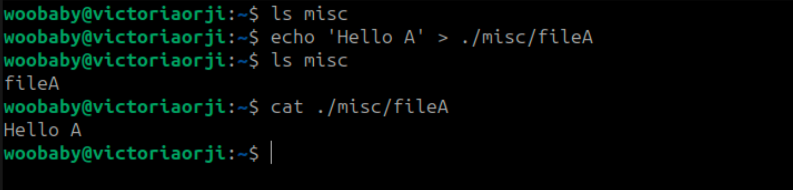

4. `Create an empty file named fileB in the misc directory. Ppoulate the file with dummy content afterwards.`

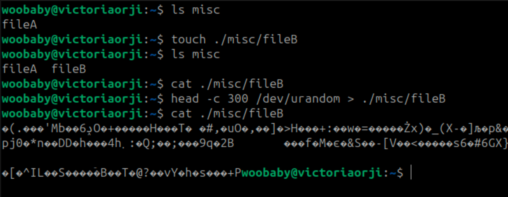

5. `Copy contents of fileA into fileC`

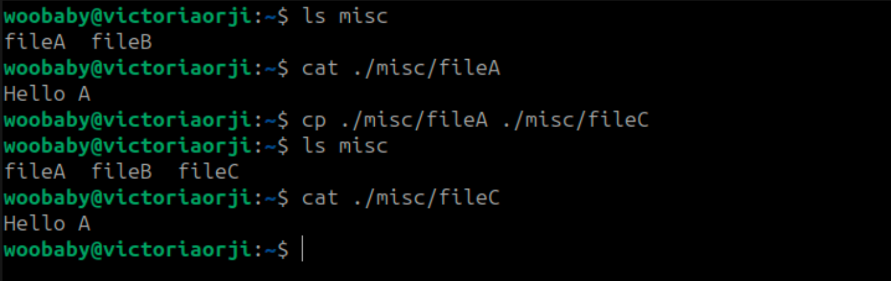

6. `Move contents of fileB into fileD`

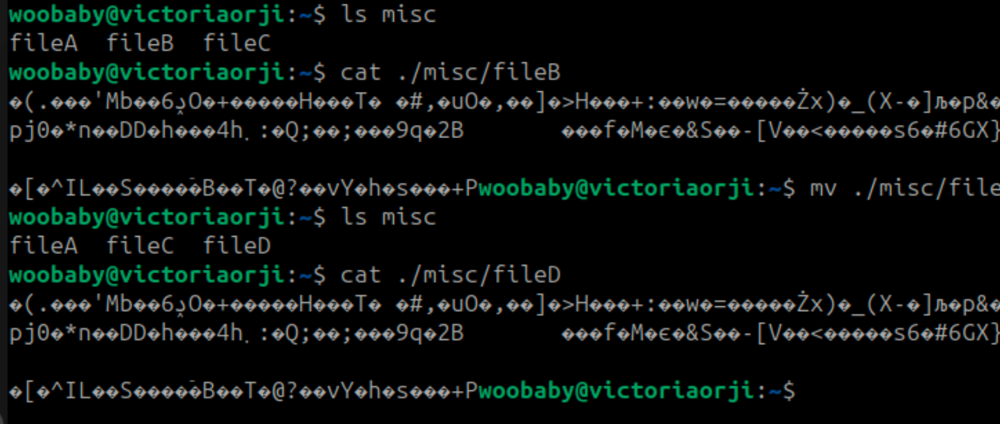

7. `Create a tar archive called misc.tar for the conntents of the misc directory` 

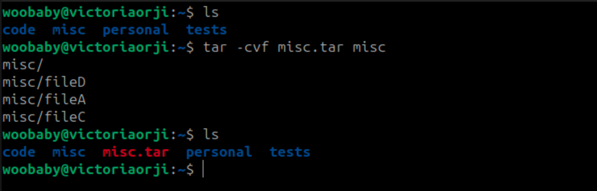

8. `Compress the tr archive to create a misc.tar.gz file`

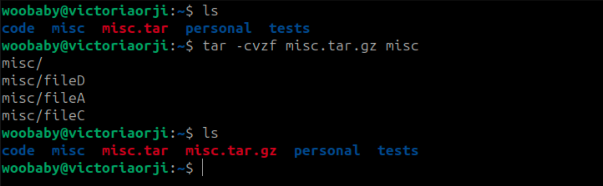

9. `Create a user and force the user to change their password upon login`

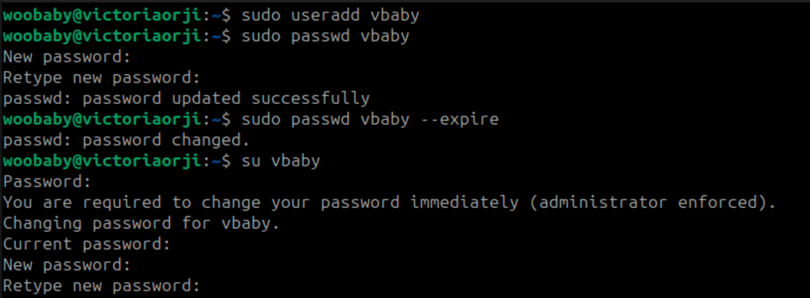

10. `Lock a user's password`

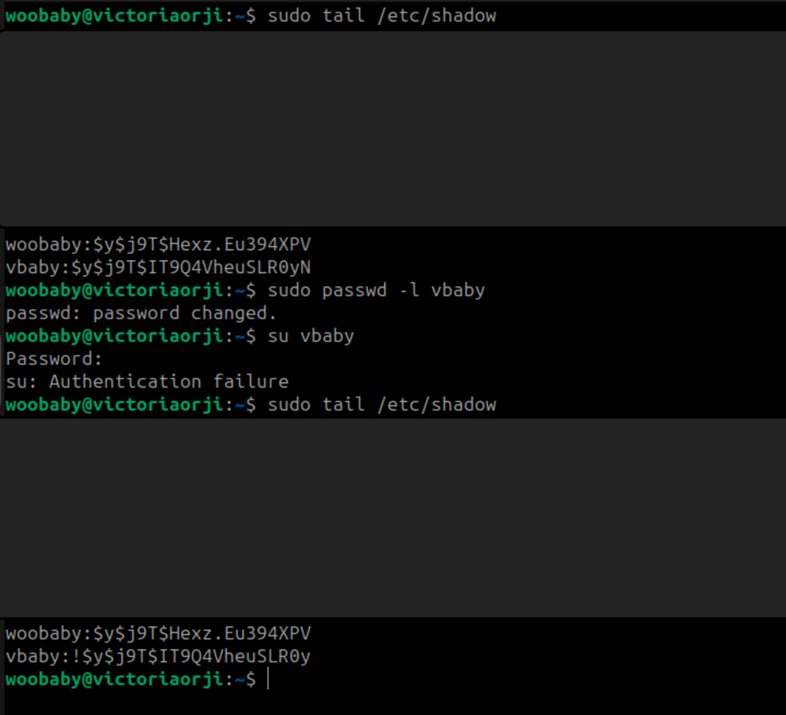

11. `Create a user with no login shell`

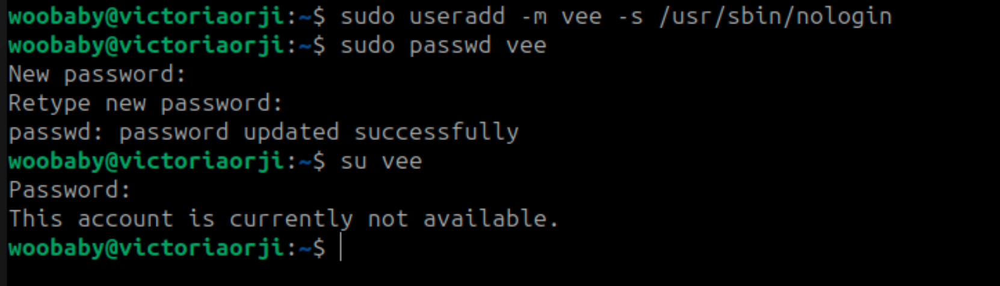

12. `Disable password based authentication for ssh`

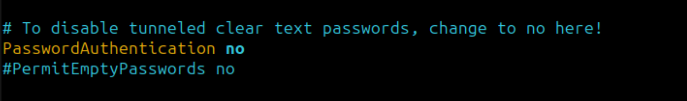

13. `Disable root login`

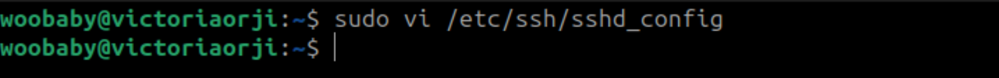
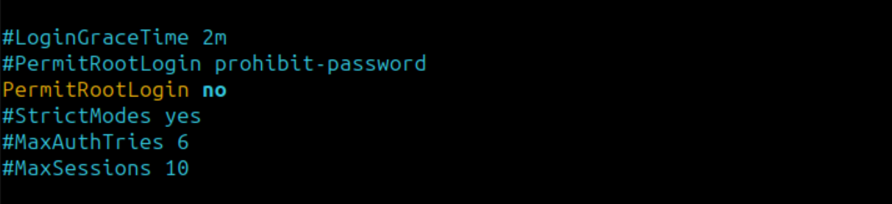